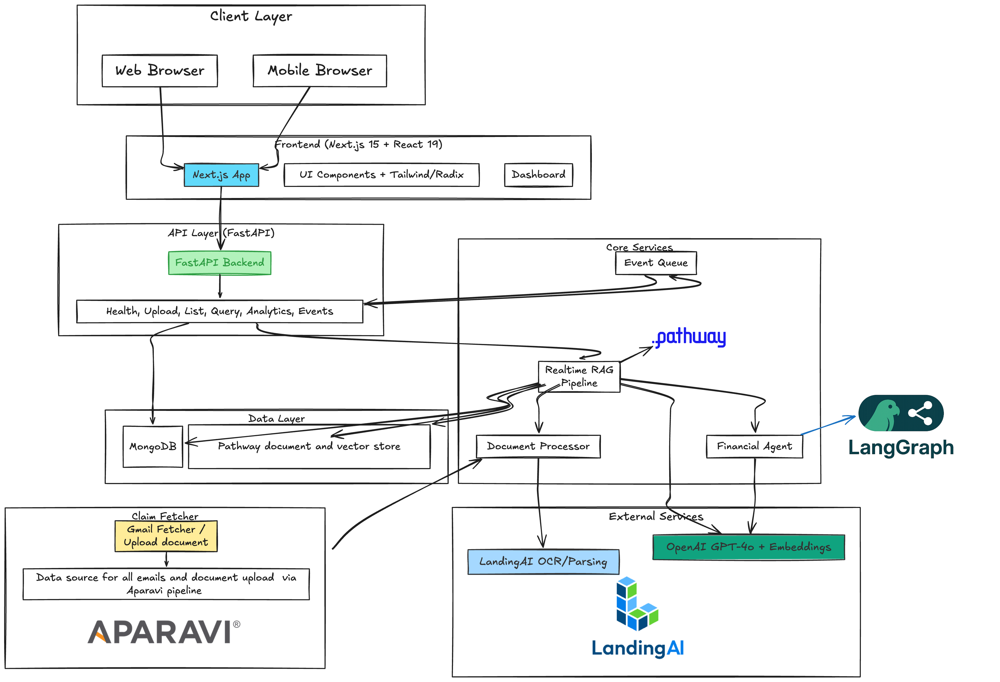

# ClaimsPilot.ai

**Intelligent Insurance Claims Automation Platform**

**Powered by [Landing AI](https://landing.ai) 🚀 [Pathway](https://pathway.com) ⚡ & [LangGraph](https://github.com/langchain-ai/langgraph) 🧠**

ClaimsPilot.ai is an enterprise-grade, AI-powered claims processing platform that automates the entire claims workflow from intake to routing. Built on **Landing AI's** advanced document intelligence, **Pathway's** real-time streaming architecture, and **LangGraph + DeepAgent's** intelligent decision engine, it reduces triage time by 92% while improving routing accuracy to 95%.

## 🎥 Video Demo

Watch the full platform demonstration: [ClaimsPilot.ai Demo](https://youtu.be/dSaQVIqdbHw)

## The Problem: Automating Claims Processing

Insurance companies are inundated with a high volume of claims in various formats, including first notice of loss, ACORD forms, police reports, and emails. The manual triage of these documents is a slow, error-prone process that leads to increased operational costs and delays in claim resolution. Key challenges include:

-   **Manual Data Entry**: Support agents spend a significant amount of time manually transcribing data from unstructured documents into internal systems.
-   **Inconsistent Routing**: Misrouting claims to the wrong adjusters or departments results in inefficiencies and rework.
-   **Delayed Fraud Detection**: The inability to flag suspicious claims early in the process leads to financial losses.

## The Solution: An AI-Powered Claims Agent

ClaimsPilot.ai is an intelligent automation platform that addresses these challenges by providing an AI-powered agent to streamline the entire claims lifecycle. The agent is designed to:

-   **Automate Document Intake**: Read and extract relevant information from a variety of claim documents.
-   **Score and Prioritize**: Assess the severity and complexity of each claim to determine priority.
-   **Intelligently Route**: Assign claims to the most appropriate adjuster based on their expertise, availability, and workload.
-   **Detect Anomalies**: Identify potential fraud, litigation, and subrogation opportunities early in the process.

## User Journey

1.  **Claim Submission**: A claims representative receives a new claim via email or direct upload.
2.  **Automated Triage**: The AI agent automatically extracts key information, scores the claim's complexity and severity, and flags it for potential fraud or other special handling.
3.  **Intelligent Routing**: The claim is routed to the best-suited adjuster, or, for minor claims, it is processed automatically.
4.  **Real-Time Monitoring**: The claims team can monitor the status of all claims in real-time through a live dashboard, with full visibility into the AI's decisions.

## Explainability: How Decisions Are Made

Explainability is a cornerstone of ClaimsPilot.ai. For every decision made by the AI agent, a clear, evidence-based rationale is provided. This includes:

-   **Extraction with Evidence**: All extracted data is linked back to its source in the original document.
-   **Clear Triage Rationale**: The system provides a detailed explanation of how it scored a claim's severity and complexity.
-   **Transparent Routing**: The logic behind each routing decision is made available, ensuring that users can understand and trust the system's recommendations.

## Table of Contents

- [Features](#-features)
- [Architecture](#️-architecture)
- [Tech Stack](#️-tech-stack)
- [Quick Start](#-quick-start)
- [Usage](#-usage)
- [API Endpoints](#-api-endpoints)
- [Demo Flow](#-demo-flow)
- [Key Metrics](#-key-metrics)
- [Project Structure](#-project-structure)
- [How It Works](#-how-it-works)
- [Configuration](#️-configuration)
- [Development](#-development)
- [Troubleshooting](#-troubleshooting)
- [Contributing](#-contributing)
- [License](#-license)

## 🚀 Features

### Core Capabilities

- **📧 Gmail Auto-Fetch Integration**: Automatically monitors Gmail inbox for claim-related emails, extracts attachments, and processes them into the system
- **📄 Smart Document Extraction**: Uses LandingAI ADE (DPT-2) to extract structured data from ACORD forms, police reports, medical records, and email attachments
- **⚡ Real-time Processing**: Pathway streaming pipeline for instant claim processing as documents arrive
- **💬 Real-time RAG System**: Powered by Pathway for real-time Retrieval-Augmented Generation. Ask any question about claims and get instant answers within seconds using natural language queries over all processed documents
- **🤖 Auto-Processing**: Automatically approves minor claims under $500 with no injuries
- **🎯 Intelligent Routing**: AI-powered adjuster matching using GPT-4o with reasoning chains
- **🔍 Fraud Detection**: Multi-factor fraud detection using pattern analysis and late reporting detection
- **📊 Severity & Complexity Scoring**: Automated risk assessment and claim prioritization
- **📈 Live Dashboard**: Real-time updates via Server-Sent Events with processing metrics
- **🔄 Auto-Transition**: Automatic status transitions based on time and amount thresholds
- **📋 Task Management**: Automated task creation and assignment to adjusters

### Advanced Features

- **Deep Agent Reasoning**: Multi-step investigation planning with evidence-based decision making
- **Document Context Management**: Maintains full document history and context for all claims
- **PDF Report Generation**: Automatically generates claim summary PDFs from emails
- **Adjuster Workload Balancing**: Real-time workload tracking and intelligent distribution

## 🏗️ Architecture

**Built on Landing AI's Document Intelligence + Pathway's Real-Time Streaming + LangGraph's Decision Engine**



### System Architecture Overview

The platform follows a modern, microservices-inspired architecture with distinct layers:

#### **Client Layer**
- **Web Browser & Mobile Browser**: Responsive interface accessible from any device
- **Vite.js Frontend**: Lightning-fast React app with TailwindCSS and Redux for state management
- **Live Dashboard**: Real-time claim monitoring with Server-Sent Events

#### **API Layer** (FastAPI Backend)
- RESTful endpoints: Health checks, Upload, List, Query, Analytics, Events
- Async request handling for maximum throughput
- Server-Sent Events for live updates

#### **Core Services**
- **Event Queue**: Real-time event broadcasting to connected clients
- **Pathway RAG Pipeline**: Streaming document processing with Landing AI integration
- **Financial Deep Agent (LangGraph)**: Multi-step reasoning and decision orchestration

#### **Data Layer**
- **MongoDB**: Primary document storage for claims, adjusters, and tasks
- **Pathway RAG Cache**: Real-time document indexing and semantic search
- **File Storage**: Original document preservation

#### **External Services**
- **Landing AI OCR/Parsing**: Industry-leading document extraction (DPT-2)
- **OpenAI GPT-4o**: Fraud detection, reasoning, and RAG embeddings

### Data Flow

```
📄 Document Upload → ⚡ Pathway Watch → 🚀 Landing AI Extract → 
📊 Score & Analyze → 🧠 LangGraph Decision Engine → 
🎯 Route to Adjuster → 💾 Store in MongoDB + Pathway RAG → 
📡 Live Dashboard Update
```

## 🛠️ Tech Stack

### Core Technologies (Powering the Entire Platform)
- **🚀 Landing AI (ADE DPT-2)**: Enterprise-grade document intelligence - extracts structured data from insurance documents with industry-leading accuracy. Powers all document processing and data extraction.
- **⚡ Pathway**: Real-time streaming data framework - provides instant file watching, processing pipeline, and live data transformations. Powers the entire claim automation workflow.
- **🧠 LangGraph + DeepAgent**: Advanced agent orchestration and multi-step reasoning framework. Powers the Decision Engine with state machines, complex workflows, and intelligent agent coordination for claim routing and investigation planning.

### Backend Services
- **FastAPI**: High-performance async API framework
- **OpenAI GPT-4o**: Fraud detection, claim parsing, routing decisions, and RAG
- **LangChain**: Agent toolkits and LLM application framework

### Data Layer
- **MongoDB (Motor)**: Async document database for claims and adjusters
- **Pathway RAG Pipeline**: Real-time document indexing and semantic search for instant question-answering over claim documents

### Integrations
- **Gmail API**: Automatic email monitoring and attachment extraction via LangChain GmailToolkit
- **Google OAuth 2.0**: Secure Gmail authentication
- **LangChain**: Agent toolkits and document loaders

### Frontend
- **Vite + React + TypeScript**: Modern, fast development experience
- **TailwindCSS**: Utility-first styling
- **Server-Sent Events**: Real-time dashboard updates
## 🚀 Quick Start

### Prerequisites

Before you begin, ensure you have the following installed:

- **Python**: Version 3.9 or higher
- **Node.js**: Version 18 or higher
- **MongoDB**: A running instance (local or cloud)
- **Git**: For cloning the repository

### API Keys

You will need the following API keys to run the application:

- [LandingAI API Key](https://landing.ai/)
- [OpenAI API Key](https://platform.openai.com/)

### Setup and Installation

1.  **Clone the Repository**

    ```bash
    git clone https://github.com/bvsbharat/claimspilot.git
    cd claimspilot
    ```

2.  **Configure Environment Variables**

    Create a `.env` file from the example and add your API keys and configuration:

    ```bash
    cp .env.example .env
    ```

    Now, edit the `.env` file with your credentials.

3.  **Set Up the Backend**

    ```bash
    cd backend
    python3 -m venv venv
    source venv/bin/activate
    pip install -r requirements.txt
    ```

4.  **Set Up the Frontend**

    ```bash
    cd ../frontend
    npm install
    ```

### Running the Application

1.  **Start the Backend Server**

    ```bash
    cd backend
    source venv/bin/activate
    uvicorn app:app --host 0.0.0.0 --port 8080 --reload
    ```

2.  **Start the Frontend Development Server**

    ```bash
    cd frontend
    npm run dev
    ```

Once both servers are running, you can access the application at `http://localhost:3030`.

## Usage

### Upload a Claim

```bash
curl -X POST http://localhost:8080/api/claims/upload \
  -F "file=@path/to/claim_document.pdf"
```

The system will automatically:
1. Extract claim data using LandingAI
2. Calculate severity and complexity scores
3. Detect fraud indicators
4. Route to appropriate adjuster
5. Send real-time updates to dashboard

## API Endpoints

#### 📋 Claims Management
- `POST /api/claims/upload` - Upload and process claim document
- `GET /api/claims/list` - List all claims with filtering
- `GET /api/claims/queue` - Get triage queue (pending assignments)
- `GET /api/claims/{claim_id}` - Get detailed claim information
- `PATCH /api/claims/{claim_id}/status` - Update claim status
- `GET /api/claims/{claim_id}/context` - Get document context for a claim

#### 👥 Adjuster Management
- `GET /api/adjusters/list` - List all adjusters
- `POST /api/adjusters/create` - Create new adjuster
- `GET /api/adjusters/{id}` - Get adjuster details
- `GET /api/adjusters/{id}/workload` - View adjuster's workload
- `PATCH /api/adjusters/{id}/availability` - Update adjuster availability

#### 📧 Gmail Integration
- `GET /api/gmail/status` - Check Gmail connection status
- `POST /api/gmail/fetch` - Manually trigger email fetch
- `GET /api/gmail/auto-fetch/status` - Get auto-fetch service status

#### 💬 Real-time RAG Chat & Q&A
- `POST /api/rag/query` - **Ask any question about claims and get instant answers**
  - Example: `{"question": "What's the claim amount for the latest auto accident?"}`
  - Returns detailed answers with sources and context within seconds
- `GET /api/rag/stats` - Get RAG service statistics (documents cached, total claims indexed)
- `GET /api/claims/{claim_id}/context` - Get full document context for specific claim

#### 📊 Analytics & Reporting
- `GET /api/analytics/fraud-flags` - Get all fraud flags
- `GET /api/analytics/metrics` - Get processing metrics
- `GET /api/analytics/dashboard` - Get dashboard statistics

#### 📋 Task Management
- `GET /api/tasks/list` - List all tasks
- `GET /api/tasks/{task_id}` - Get task details
- `PATCH /api/tasks/{task_id}/status` - Update task status

#### 🔔 Real-time Events
- `GET /api/events/stream` - Server-Sent Events stream for live updates

## Testing with Dummy Data

To help you get started, we have included a `dummy-claims` directory containing sample claim documents. You can use these files to test the application's upload and processing capabilities.

## Demo Flow

### Claim 1: Simple Auto Accident
```bash
# Upload police report
curl -X POST http://localhost:8080/api/claims/upload \
  -F "file=@demo_data/auto_accident.pdf"

# Result:
# - $8K damage, no injuries
# - Low complexity, Medium severity
# - Routed to Junior adjuster (auto specialist)
# - Time: ~30 seconds
```

### Claim 2: Complex Commercial Loss
```bash
# Upload ACORD form
curl -X POST http://localhost:8080/api/claims/upload \
  -F "file=@demo_data/commercial_fire.pdf"

# Result:
# - $2M property damage
# - High complexity, High severity
# - Flag: Subrogation potential
# - Routed to Senior adjuster with investigation checklist
```

### Claim 3: Suspicious Injury
```bash
# Upload medical records
curl -X POST http://localhost:8080/api/claims/upload \
  -F "file=@demo_data/injury_claim.pdf"

# Result:
# - Soft tissue injury, reported 29 days late
# - Flag: Fraud risk (late reporting)
# - Routed to SIU (Special Investigation Unit)
```

## 📊 Key Metrics

- **⚡ Triage Time**: 25 min → 2 min (92% reduction)
- **🎯 Routing Accuracy**: 70% → 95%
- **🔍 Early Fraud Detection**: +40%
- **💰 Cost per Claim**: -$500
- **🤖 Auto-Approval Rate**: ~15% of claims (minor incidents)
- **⚙️ Processing Speed**: ~30 seconds per claim (end-to-end)
- **💬 RAG Query Response Time**: < 3 seconds (instant answers to any claim question)

## 📁 Project Structure

```
claimspilot/
├── backend/
│   ├── app.py                        # FastAPI application entry point
│   ├── api/
│   │   └── routes.py                 # All API endpoints
│   ├── services/
│   │   ├── document_processor.py     # LandingAI ADE integration
│   │   ├── claim_scorer.py           # Severity & complexity scoring
│   │   ├── fraud_detector.py         # Fraud detection engine
│   │   ├── router_engine.py          # Intelligent routing logic
│   │   ├── deepagent_service.py      # Deep reasoning & investigation planning
│   │   ├── pathway_pipeline.py       # Real-time file processing pipeline
│   │   ├── gmail_service.py          # Gmail API integration
│   │   ├── gmail_auto_fetch.py       # Auto email monitoring service
│   │   ├── rag_service.py            # RAG Q&A system
│   │   ├── auto_processor.py         # Auto-approval logic
│   │   ├── auto_transition.py        # Automatic status transitions
│   │   ├── task_manager.py           # Task creation & management
│   │   ├── pdf_generator.py          # Email-to-PDF conversion
│   │   ├── document_context.py       # Document history tracking
│   │   ├── mongodb_service.py        # MongoDB async operations
│   │   ├── sync_mongodb.py           # MongoDB sync operations (for Pathway)
│   │   └── event_queue.py            # Server-Sent Events
│   ├── models/
│   │   ├── claim.py                  # Claim data models
│   │   └── adjuster.py               # Adjuster data models
│   ├── scripts/
│   │   ├── seed_adjusters.py         # Seed demo adjusters
│   │   └── clear_mongodb.py          # Database cleanup
│   ├── requirements.txt              # Python dependencies
│   └── credentials.json              # Gmail OAuth credentials (gitignored)
├── frontend/
│   ├── src/
│   │   ├── components/               # React components
│   │   ├── App.tsx                   # Main application
│   │   └── main.tsx                  # Entry point
│   ├── package.json                  # Node dependencies
│   └── vite.config.ts                # Vite configuration
├── uploads/                          # Watched by Pathway (gitignored)
├── demo_data/                        # Sample claim documents
├── .env.example                      # Environment variables template
├── .gitignore                        # Git ignore rules
├── start.sh                          # Convenience start script
└── README.md                         # This file
```

## 🔧 How It Works

### 1. **Document Intake** (Powered by Pathway)
- **Upload**: Drop a claim document via web UI or API
- **Gmail Auto-Fetch**: System automatically monitors Gmail inbox every 5 minutes for claim-related emails
- **File Watching**: **Pathway's** streaming engine monitors the `uploads/` directory in real-time
- **Instant Processing**: The moment a file arrives, Pathway triggers the entire automation pipeline
- Pathway ensures zero-latency processing from document arrival to adjuster assignment

### 2. **Extraction Phase** (Powered by Landing AI)
- Document is sent to **Landing AI's ADE (DPT-2)** - the industry-leading document intelligence platform
- Extracts structured data with enterprise-grade accuracy: claim amounts, dates, parties, injuries, descriptions
- Handles complex insurance documents: ACORD forms, police reports, medical records, and emails
- Text and tables extracted with industry-leading precision
- Landing AI powers all document understanding capabilities

### 3. **Analysis Phase**
- **Scoring Engine**: Calculates severity (0-100) and complexity (0-100) scores based on:
  - Claim amount thresholds
  - Injury severity (fatal > critical > serious > moderate > minor)
  - Multi-party involvement
  - Attorney involvement
  - Subrogation potential
- **Fraud Detection**: Identifies suspicious patterns:
  - Late reporting (>14 days)
  - Inconsistent statements
  - High-value claims
  - Multiple previous claims

### 4. **Decision Engine** (Powered by LangGraph + DeepAgent)
The real-time decision engine uses **LangGraph** for agent orchestration and **DeepAgent** for multi-step reasoning:

- **LangGraph State Machines**: Manages complex claim workflows with stateful decision trees
- **Multi-Agent Coordination**: Orchestrates multiple AI agents working together on complex claims
- **Auto-Processing**: Claims under $500 with no injuries automatically approved through agent workflows
- **Deep Reasoning (DeepAgent)**: Complex claims get multi-step investigation plans with:
  - Evidence-based decision making
  - Step-by-step reasoning chains
  - Investigation priority planning
  - Risk assessment and timeline estimation
- **Smart Routing**: AI matches claims to adjusters based on:
  - Specialization (auto, property, injury, commercial)
  - Experience level (junior, mid, senior)
  - Current workload
  - Claim complexity fit
  - Semantic matching via LangGraph agent coordination

### 5. **Real-time RAG System** (Powered by Pathway)
The system provides instant conversational access to all claim data using Pathway's real-time RAG capabilities:

- **Instant Responses**: Ask questions and get answers within seconds about any processed claim
- **Natural Language Interface**: No need to learn complex queries - just ask in plain English
- **Examples of Questions You Can Ask**:
  - "What's the claim amount for CLM-2025-001234?"
  - "Show me all claims with fraud flags from last week"
  - "What injuries were reported in the latest auto accident claim?"
  - "Which adjuster is handling the commercial fire claim?"
  - "Summarize the policy details for claim X"
- **Powered by Pathway RAG**: Real-time Retrieval-Augmented Generation with live document indexing
- **Context-Aware**: Understands claim context, relationships, and history
- **Live Data**: Every newly processed claim is immediately available for queries with zero latency
- **Streaming Search**: Pathway's streaming architecture ensures instant semantic search across all documents

### 6. **Output & Tracking**
- **Task Creation**: Automatically creates tasks for assigned adjusters
- **MongoDB Storage**: All claim data, decisions, and history stored
- **Pathway RAG Indexing**: Real-time document indexing for instant semantic search
- **Live Dashboard**: Real-time SSE updates on processing status
- **Auto-Transition**: Claims automatically move through workflow stages

## ⚙️ Configuration

All sensitive data should be in `.env` file (never commit to git):

```env
# Server
HOST=0.0.0.0
PORT=8080

# LandingAI - Document Extraction
VISION_AGENT_API_KEY=your_landingai_key_here
LANDINGAI_API_KEY=your_landingai_key_here

# OpenAI - GPT-4o for reasoning
OPENAI_API_KEY=your_openai_key_here

# MongoDB - Document Database
MONGODB_URI=mongodb://localhost:27017
MONGODB_DATABASE=claims_triage

# Pathway - File Watching
DATA_DIR=./uploads

# Gmail Auto-Fetch (Optional)
GMAIL_AUTO_FETCH_ENABLED=true
GMAIL_AUTO_FETCH_INTERVAL_MINUTES=5
GMAIL_AUTO_FETCH_DAYS_BACK=7
GMAIL_AUTO_FETCH_MAX_RESULTS=10
```

## Development

### Add New Adjuster

```python
POST /api/adjusters/create
{
  "adjuster_id": "adj_001",
  "name": "Mike Johnson",
  "email": "mike@insurance.com",
  "specializations": ["auto", "property"],
  "experience_level": "junior",
  "years_experience": 2,
  "max_claim_amount": 50000,
  "max_concurrent_claims": 15,
  "territories": ["CA", "NV"]
}
```

### Monitor Real-time Events

```javascript
const eventSource = new EventSource('http://localhost:8080/api/events/stream');

eventSource.onmessage = (event) => {
  const data = JSON.parse(event.data);
  console.log('Event:', data.type, data.message);
};
```

## 🐛 Troubleshooting

-   **`ModuleNotFoundError`**: Ensure you have activated the Python virtual environment (`source backend/venv/bin/activate`) before running the backend.
-   **Frontend issues**: If you encounter issues with the frontend, try deleting the `node_modules` directory and running `npm install` again.
-   **API Key errors**: Double-check that your API keys in the `.env` file are correct and have the necessary permissions.

## 🤝 Contributing

Contributions are welcome! If you'd like to contribute, please follow these steps:

1.  Fork the repository.
2.  Create a new branch (`git checkout -b feature/your-feature-name`).
3.  Make your changes and commit them (`git commit -m 'Add some feature'`).
4.  Push to the branch (`git push origin feature/your-feature-name`).
5.  Create a new Pull Request.

## 📄 License

This project is licensed under the MIT License. See the [LICENSE](LICENSE) file for details.

## 🙏 Acknowledgments

### Core Platform Technologies

**ClaimsPilot.ai is proudly powered by:**

- **🚀 [Landing AI](https://landing.ai/)** - The engine behind our document intelligence. Landing AI's ADE (Automated Document Extraction) with DPT-2 provides enterprise-grade accuracy for extracting structured data from complex insurance documents. Without Landing AI, this platform wouldn't be possible.

- **⚡ [Pathway](https://pathway.com/)** - The real-time streaming framework that powers our entire automation workflow. Pathway's live data processing enables instant file watching, claim processing, and real-time updates that make our system blazingly fast.

- **🧠 [LangGraph](https://github.com/langchain-ai/langgraph) + [DeepAgent](https://github.com/langchain-ai/deepagents)** - The intelligent decision engine. LangGraph provides state machine orchestration and multi-agent coordination, while DeepAgent enables sophisticated multi-step reasoning and investigation planning for complex claims.

### Additional Technologies

- [OpenAI](https://openai.com/) - GPT-4o language models for reasoning and fraud detection
- [FastAPI](https://fastapi.tiangolo.com/) - Modern Python web framework
- [LangChain](https://www.langchain.com/) - LLM application framework
- [MongoDB](https://www.mongodb.com/) - Document database

## 📧 Support & Contact

- **Issues**: [GitHub Issues](https://github.com/bvsbharat/claimspilot/issues)
- **Discussions**: [GitHub Discussions](https://github.com/bvsbharat/claimspilot/discussions)
- **Email**: support@claimspilot.ai

---

**ClaimsPilot.ai** - Automating Insurance Claims with AI 🚀
